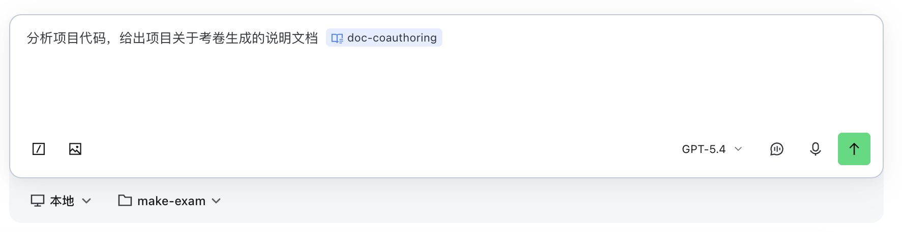
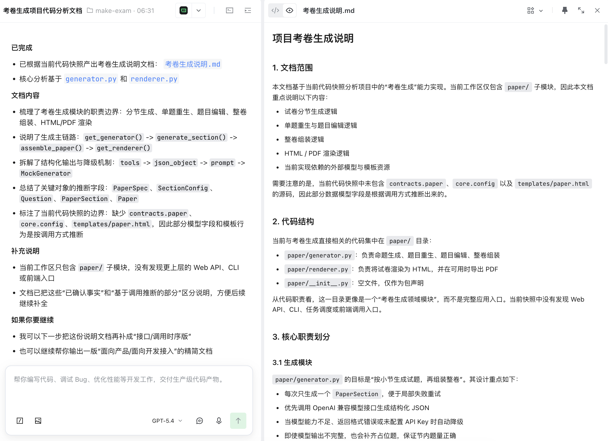
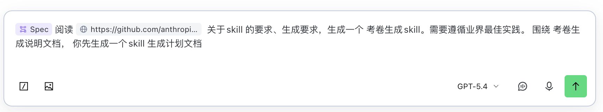
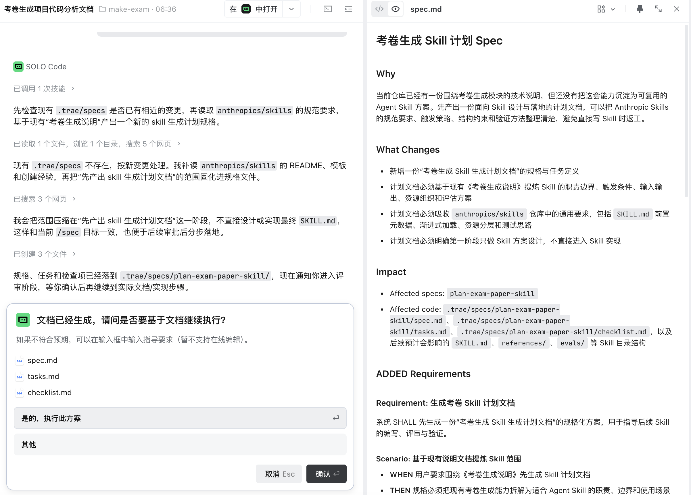
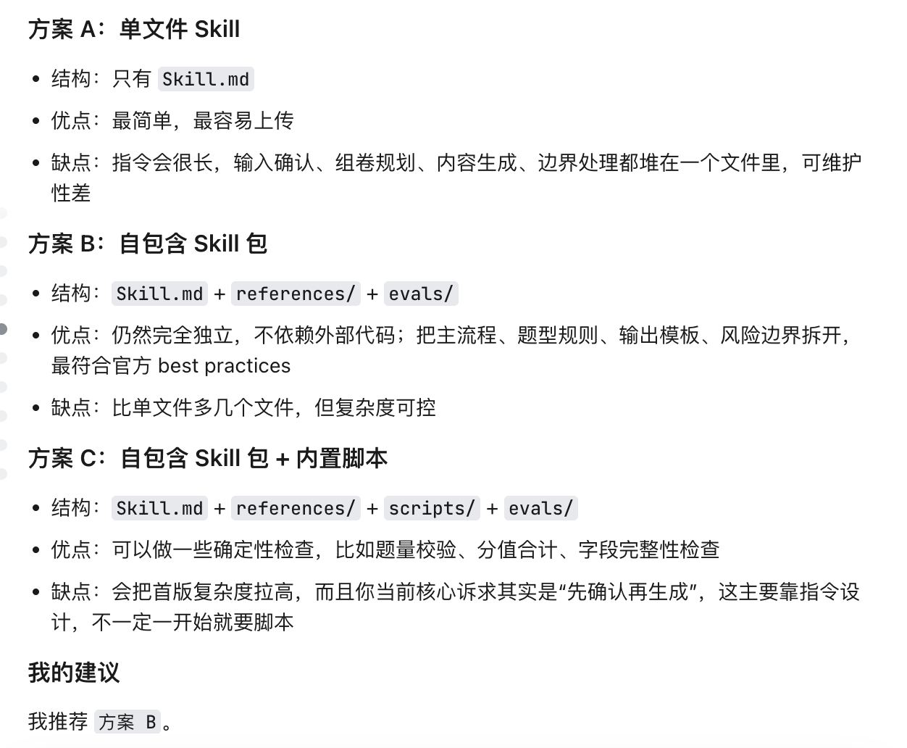
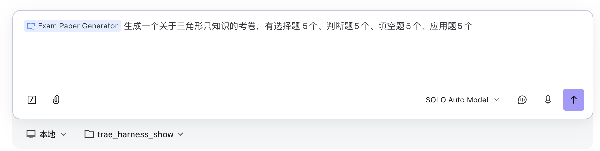
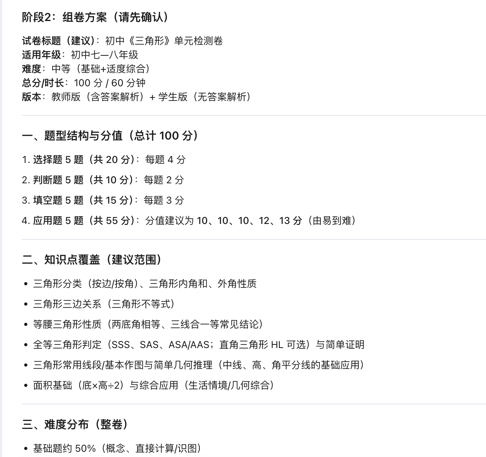
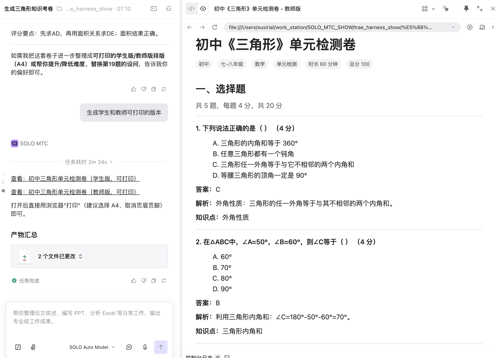

# make-exam


一个围绕“考卷生成”场景构建的实验项目。

这个仓库记录了一个完整的过程：先分析现有考卷生成代码思路，再整理为说明文档与 Spec，最后沉淀成一个**独立、可打包上传、可生成教师版 / 学生版 HTML 的 Claude Skill**。

## 项目目标

本项目不是一个完整的 Web 应用，而是一个围绕试卷生成工作流的实践仓库，重点验证以下能力：

- 从现有代码中提炼考卷生成的方法论
- 将方法论整理为结构化文档
- 参考 Anthropic / Claude 自定义 Skill 规范设计独立 Skill
- 让 Skill 具备固定工作流：
  - 先确认用户需求
  - 再生成组卷方案
  - 用户确认后再生成完整试卷内容
  - 最终输出结构化结果与教师版 / 学生版 HTML

## 当前成果

仓库当前已经完成以下产物：

- 一个独立 Skill 包：`exam-paper-generator/`
- 一套参考文档：输入清单、统一结构、渲染规则、边界说明
- 一组 Python 脚本：方案校验、试卷归一化、试卷校验、HTML 渲染
- 两个 Jinja2 模板：
  - 教师版 HTML
  - 学生版 HTML
- 一组示例过程截图，用于说明整个从分析到实现的链路

## 仓库结构

```text
make-exam/
├── exam-paper-generator/
│   ├── Skill.md
│   ├── references/
│   ├── scripts/
│   ├── assets/templates/
│   └── evals/
├── images/
└── .trae/specs/
```

### 关键目录说明

#### `exam-paper-generator/`

最终产出的独立 Skill 包，不依赖当前仓库中其他本地代码。

- `Skill.md`
  - Skill 主入口
  - 定义触发条件、工作流、输入确认、方案生成、内容生成和 HTML 输出
- `references/`
  - 拆分出的辅助文档，避免把所有逻辑都堆在 `Skill.md`
- `scripts/`
  - 放确定性脚本：
    - `validate_plan.py`
    - `normalize_paper.py`
    - `validate_paper.py`
    - `render_html.py`
- `assets/templates/`
  - Jinja2 模板：
    - `teacher.html.j2`
    - `student.html.j2`
- `evals/`
  - 放测试 prompts，用于验证 Skill 触发与行为

#### `images/`

保存本项目关键过程截图，用于展示从“分析代码”到“生成 Skill”和“实际生成试卷页面”的全过程。

#### `.trae/specs/`

保存本项目在实现 Skill 前整理出的 Spec、任务拆解和检查项。

## Skill 设计思路

这个仓库最终采用的是**自包含 Skill 包**的设计，而不是简单单文件说明。

核心原则如下：

- Skill 本身独立存在，不 import `paper/` 或其他项目代码
- 优先把能力沉淀为工作流，而不是把底层实现细节强绑进 Skill
- 先生成结构化试卷内容，再通过 Jinja2 模板渲染 HTML
- 教师版 / 学生版共享同一份数据源，只在展示层做差异

### 固定工作流

1. 识别任务类型
2. 确认学段、年级、学科、分值、题型等关键输入
3. 输出组卷方案
4. 等待用户确认方案
5. 生成完整试卷内容
6. 归一化并校验试卷结构
7. 生成教师版 / 学生版 HTML

## 技术实现

### 文档与 Skill 层

- `Skill.md` 负责：
  - 何时触发
  - 何时不触发
  - 先确认、后方案、再内容的工作流约束
  - 输出格式和分支处理逻辑

### 脚本层

- `validate_plan.py`
  - 校验组卷方案中的题量、分值和总分一致性
- `normalize_paper.py`
  - 把试卷内容整理成统一结构
- `validate_paper.py`
  - 校验完整试卷结构是否合法
- `render_html.py`
  - 使用 Jinja2 渲染教师版或学生版 HTML

### 模板层

采用 Jinja2 模板生成 HTML：

- 教师版显示答案、解析、知识点等信息
- 学生版只显示题目和作答区域

## 使用方式

### 1. 进入 Skill 目录

```bash
cd exam-paper-generator
```

### 2. 安装依赖

建议使用虚拟环境：

```bash
python3 -m venv .venv
source .venv/bin/activate
pip install jinja2
```

### 3. 校验组卷方案

```bash
python3 scripts/validate_plan.py path/to/plan.json
```

### 4. 归一化试卷内容

```bash
python3 scripts/normalize_paper.py path/to/paper.json -o path/to/paper.normalized.json
```

### 5. 校验完整试卷

```bash
python3 scripts/validate_paper.py path/to/paper.normalized.json
```

### 6. 渲染 HTML

教师版：

```bash
python3 scripts/render_html.py path/to/paper.normalized.json --variant teacher -o teacher.html
```

学生版：

```bash
python3 scripts/render_html.py path/to/paper.normalized.json --variant student -o student.html
```

## 项目过程

下面这些截图展示了这个仓库是如何一步步构建出来的。

### 1. 先分析现有代码并生成说明文档



### 2. 基于代码分析结果产出“考卷生成说明”



### 3. 参考 Anthropic Skills 要求，先产出 Skill 计划 Spec



### 4. 进入 Spec 阶段，明确 Skill 设计边界与任务拆分



### 5. 对 Skill 结构方案进行对比与决策



### 6. 实际使用 Skill 生成考卷任务



### 7. Skill 先输出组卷方案，等待用户确认



### 8. 生成可打印的教师版 / 学生版结果



## 为什么这个项目有价值

这个仓库展示的不是单纯“写了一个脚本”，而是一个更完整的 AI 工程实践过程：

- 从已有代码中提炼业务能力
- 把业务能力转成文档与规格
- 再把规格转成独立 Skill
- 最终把 Skill 落成实际可用的结构化输出与 HTML 产物

它适合作为以下方向的参考：

- Claude 自定义 Skill 设计
- 教育场景下的试卷生成工作流
- 结构化内容到 HTML 模板渲染的实现方式
- Spec 驱动的 AI 项目整理方式

## 已知边界

当前仓库聚焦 Skill 与工作流沉淀，不包含以下内容：

- 完整 Web API
- 数据库存储
- PDF 导出链路
- 外部模型服务集成
- 真实教研题库接入

如果后续需要，这个仓库可以继续扩展为：

- 带 PDF 输出的试卷生成工具
- 带前端页面的组卷应用
- 接入题库或大模型的完整命题系统

## 后续可扩展方向

- 增加 PDF 导出
- 增加更严格的 `evals`
- 增加更多题型模板
- 增加数学公式渲染增强
- 增加教师版 / 学生版更完整的打印样式

## License

当前仓库未单独声明 License。如需开源发布，建议补充许可证文件。
